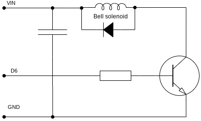

A DIY IoT doorbell
-------------------

This is a project to add smart features to an existing battery powered doorbell
using a NodeMCU with Arduino libraries. The doorbell will be converted to run
off USB power instead of batteries.

Features:

 * Connects to an MQTT broker via Wifi
 * Sends an MQTT message when doorbell button is pushed
   * No network dependency: the bell will ring even when not connected
 * Remote ringing: ring the bell by sending an MQTT message to the doorbell
 * Door sensor: reports whether the door is open
 * ~~PIR sensor: detects motion when someone steps into the vestibule~~

## MQTT

The doorbell uses MQTT protocol to communicate with a smart home hub.
A device discovery message is sent for automatic integration with [Home Assistant].

### Topics

A common prefix that uniquely identifies the device is used. This is configurable,
but in this project, the prefix `diy/frontdoor` will be used.

#### PREFIX/available

When the device connects, a retained message with the body `online` will
be published here. A last will message `offline` is also registered.

#### PREFIX/button

When the doorbell button is pressed, a message will be published here.
The payload can be one of:

 * `press` - button was pressed

#### PREFIX/bell

The doorbell will listen for messages on this topic to ring the bell.

Accepted payloads:

 * `1-9` - ring the bell the given number of times

#### PREFIX/door

State of the door sensor is published here.
The payload can be one of:

 * `open`
 * `closed`

#### PREFIX/pir

State of the PIR detector is published here.
The payload can be one of:

 * `motion`
 * `clear`

**Not implemented at the moment**. The PIR module I had is incredibly
sensitive to electrical noise. Ringing the bell makes it go crazy, and
simply having the NodeMCU's wifi on generates constant false positives.

#### Homeassistant discovery

To support Home Assistant's MQTT device autodiscovery, configuration
messages are published at the following topics:

 * `homeassistant/binary_sensor/frontdoor/door/config`
 * `homeassistant/device_automation/button_short_press/door/config`

## Hardware

### Bell

A common battery powered doorbell is used as the base. These are simple devices:
pressing the button connects the battery to a solenoid whose plunger hits
a metal plate to make a *ding* noise.

In our use, the button will be connected to the solenoid via software. The coil
cannot be directly wired into the GPIO port, since the controller can source very
little current, so a transistor is needed. To protect the transistor from inductive
kick, we also need a diode and a capacitor.

The value of the resistor depends on the transistor you pick. Check the
datasheet, but something around 1K is typical.

### Button

We'll use the existing doorbell button. This can be wired directly to a GPIO pin
with the internal pullup enabled. This means `digitalRead()` will return `0` when
the button is pressed.

### Door sensor

A common door switch (magnet + reed switch pair) is used. It is connected in the
same way as the button.

### PIR sensor

The PIR sensor is an optional feature that complements the door switch. It can be used
to detect event sequences such as: no motion, door opened -> someone coming in,
or motion detected and door opened -> someone going out.

The type of PIR sensor I'm using/was planning to use has three pins: power, ground and signal. The signal pin
is open-collector: it is pulled low when motion is detected. It can be connected to a GPIO
pin with the internal pull-up enabled.

However, it turned out the sensor is very noise sensitive. NodeMCU's wifi generates
constant false positives, making the sensor unusable, so this feature is not enabled currently.

### NodeMCU

The NodeMCU board is the brains of the doorbell.

We'll need to use the following GPIO pins:

 * D1 (for door sensor)
 * D2 (for button)
 * D4 (connected to on-board LED, good for debugging)
 * D5 (for PIR module)
 * D6 (for bell)

Not all of the GPIO pins on the NodeMCU are usable. A good reference
can be found here: https://randomnerdtutorials.com/esp8266-pinout-reference-gpios/

We can get power for the bell solenoid and PIR sensor from the VIN pin.
The PIR module from Sparkfun has an onboard 3.3V regulator. By bridging the input and
output pins, it can be powered by NodeMCU's 3V3 pin.
